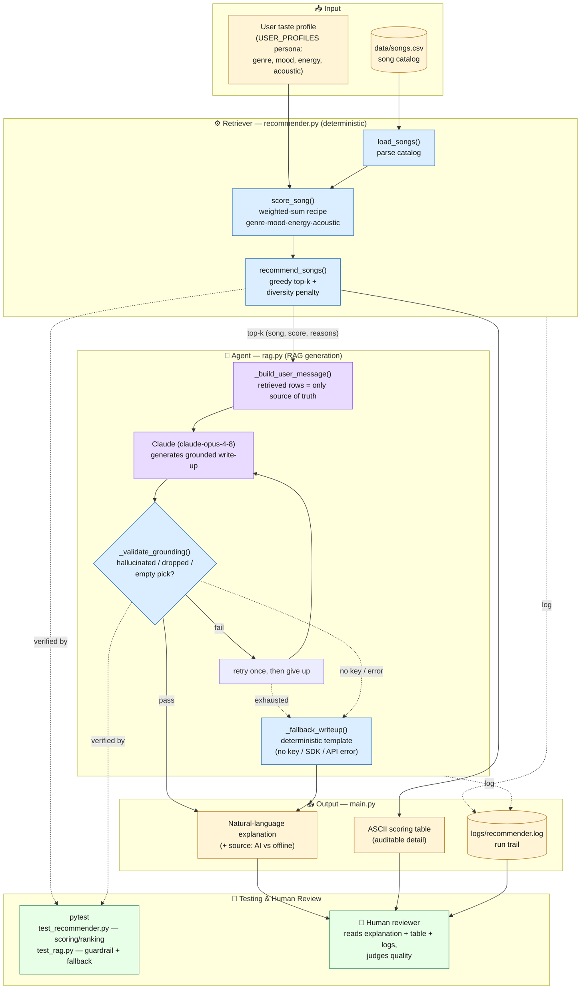

# Music Recommender Simulation — System Diagram

A retrieval-augmented (RAG) music recommender. A deterministic scorer **retrieves**
the top songs, Claude **generates** a grounded explanation of them, a code
**guardrail** verifies the AI stayed grounded, and **pytest + humans** check the
results.

## How to read it

| Stage | Component | Role |
|-------|-----------|------|
| **Input** | `data/songs.csv` + a `USER_PROFILES` persona | The catalog and the listener's taste |
| **Retriever** | `recommender.py` (`load_songs`, `score_song`, `recommend_songs`) | Deterministically scores every song and retrieves the diversity-aware top-k |
| **Agent (RAG)** | `rag.py` → Claude | Generates a natural-language explanation grounded **only** in the retrieved rows |
| **Guardrail** | `_validate_grounding()` | Rejects hallucinated, dropped, or empty picks; retries once, else falls back |
| **Fallback** | `_fallback_writeup()` | Deterministic template so the app always runs without an API key |
| **Output** | `main.py` | Prints the explanation, an auditable scoring table, and logs the run |
| **Testing** | `tests/` (pytest) | `test_recommender.py` checks scoring/ranking; `test_rag.py` checks the guardrail + fallback |
| **Human** | Reviewer | Reads the explanation, table, and logs to judge whether the AI output is trustworthy |

### Where AI results get checked
1. **Automated in-code guardrail** — `_validate_grounding()` verifies every Claude
   generation against the retrieved set on each run (with one retry, then fallback).
2. **Automated tests** — pytest exercises the guardrail and fallback offline (no key needed).
3. **Human review** — a person inspects the printed explanation against the
   transparent scoring table and `logs/recommender.log`.